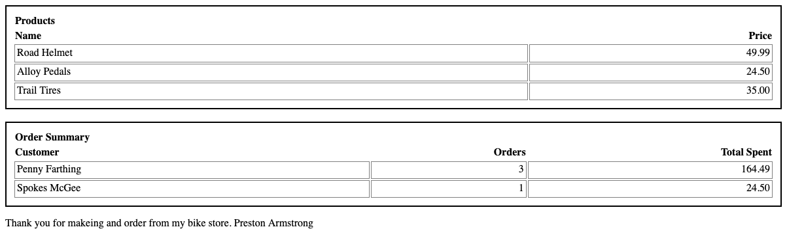

# 239-Exam-2
 
## Description 
Seccond exam
 
## Requirements 
- PHP installed (7.4+ or whatever version you are using
- Local server (XAMPP, MAMP etc) 
- Web browser 
 
## Installation 
1. Clone or download the repository. 
2. Place the project folder into your server's web root (e.g., htdocs/ for XAMPP) 
3. Start the server. 
 
## Repo 
[239-exam2](https://github.com/PresnoArmweak/exam2.git) 
 
## Screenshot of homepage 
 
 
## Markdown Cheat Sheet 
[cheatsheet](https://www.markdownguide.org/cheat-sheet/) ) 
